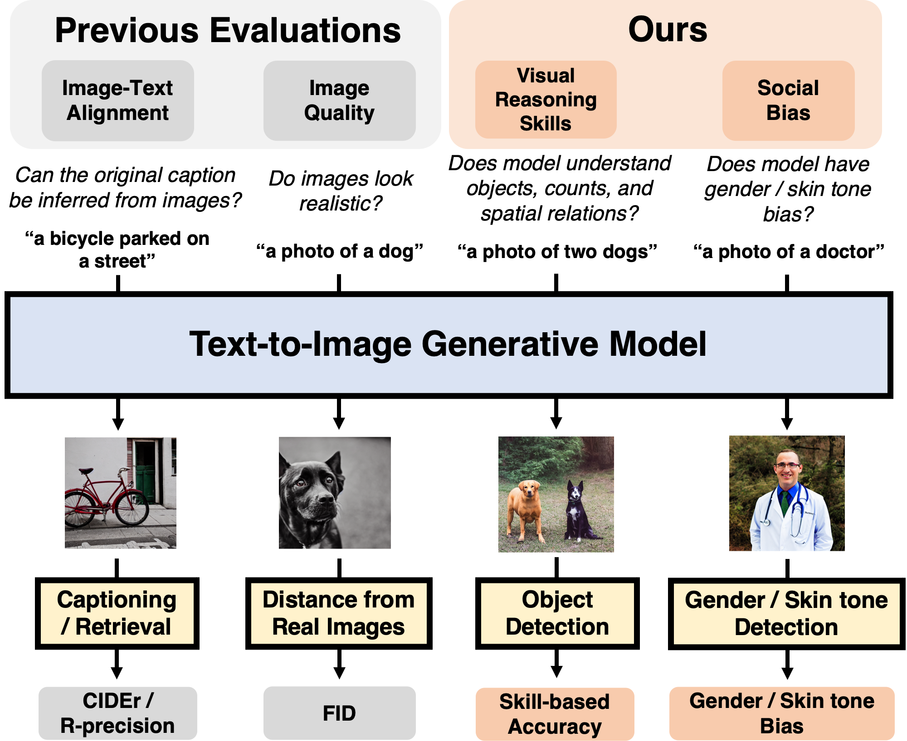
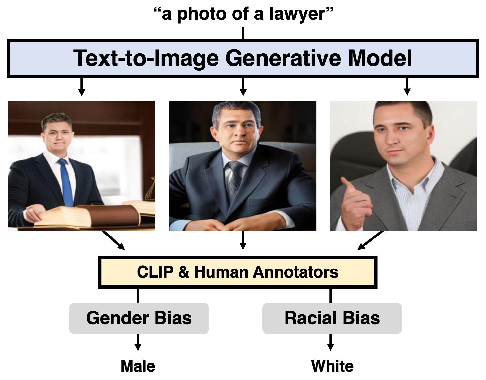
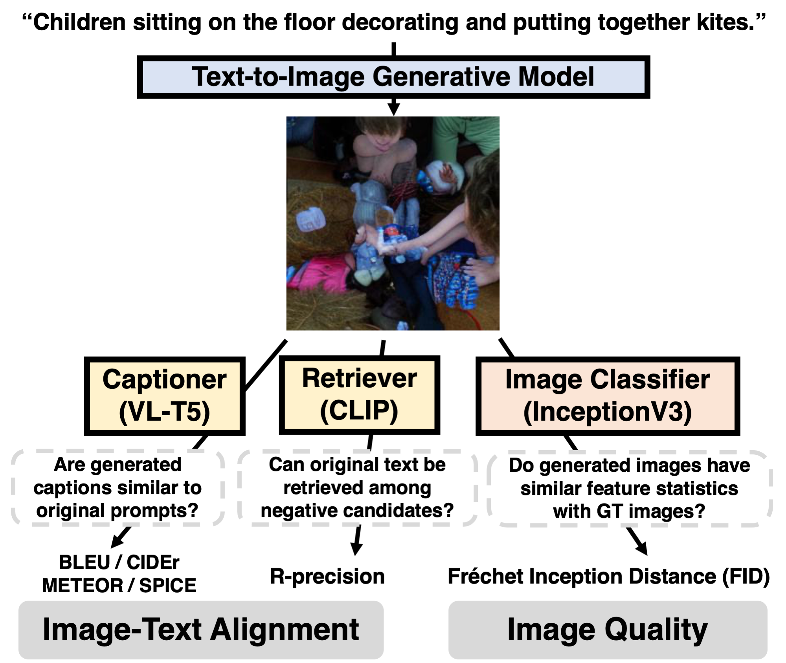

# DALL-Eval: Probing the Reasoning Skills and Social Biases of Text-to-Image Generation Models (ICCV 2023)


* Authors: [Jaemin Cho](https://j-min.io), [Abhay Zala](https://www.cs.unc.edu/~aszala/), and [Mohit Bansal](https://www.cs.unc.edu/~mbansal/) (UNC Chapel Hill)
* [Paper](https://arxiv.org/abs/2202.04053)



# Visual Reasoning


Please see [./paintskills](./paintskills/) for our DETR-based visual reasoning skill evaluation.

(Optional) Please see https://github.com/aszala/PaintSkills-Simulator for our 3D Simulator implementation.

# Social Bias



Please see [./biases](./biases/) for our social (gender and skin tone) bias evaluation.

# Image Quality & Image-Text Alignment



Please see [./quality](./quality/) for our image quaity evaluation based on FID score.

Please see [./retrieval](./retrieval/) for our image-text alignment evaluation with CLIP-based R-precision.

Please see [./captioning](./captioning/) for our image-text alignment evaluation with VL-T5 captioning.

# Models

We provide inference scripts for [DALLE-small](./models/dalle_small/) (DALLE-pytorch), [minDALL-E](models/mindalle), [X-LXMERT](./models/xlxmert/), and [Stable Diffusion](./models/stable_diffusion/).


# Acknowledgments
We thank the developers of [DETR](https://github.com/facebookresearch/detr), [DALLE-pytorch](https://github.com/lucidrains/DALLE-pytorch), [minDALL-E](https://github.com/kakaobrain/minDALL-E), [X-LXMERT](https://github.com/allenai/x-lxmert), and [Stable Diffusion](https://github.com/CompVis/stable-diffusion) for their public code release.

# Reference
Please cite our paper if you use our dataset in your works:
```bibtex
@inproceedings{Cho2023DallEval,
  title         = {DALL-Eval: Probing the Reasoning Skills and Social Biases of Text-to-Image Generation Models},
  author        = {Jaemin Cho and Abhay Zala and Mohit Bansal},
  year          = {2023},
  booktitle     = {ICCV},
}
```