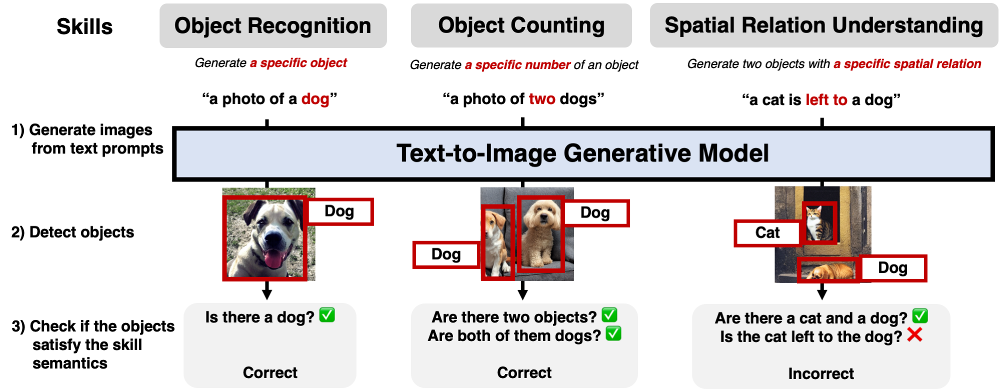
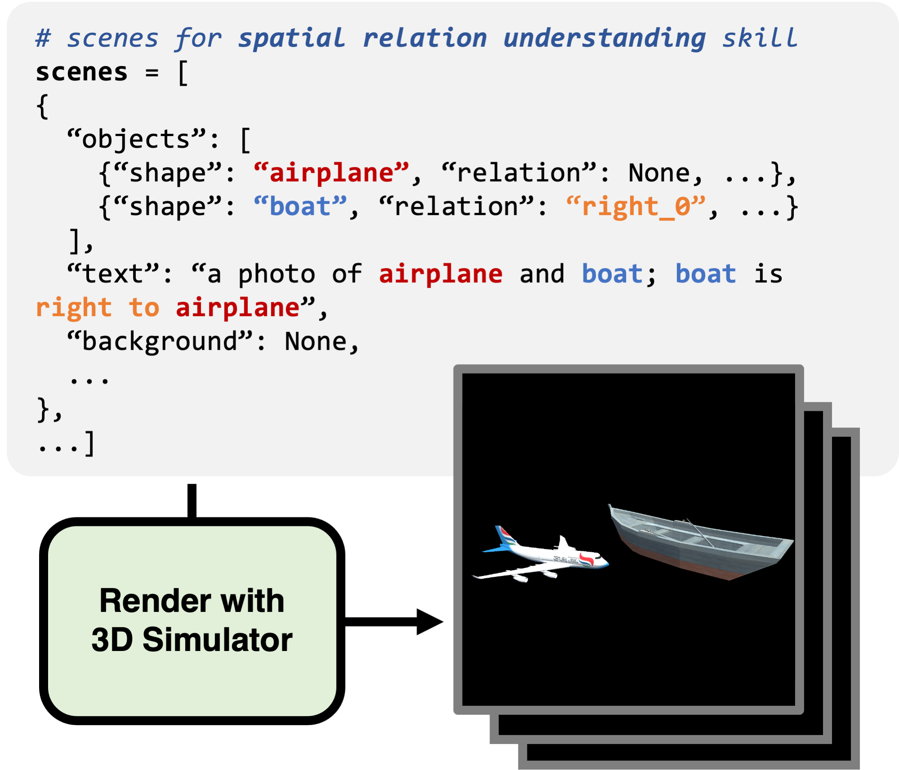

# Visual Reasoning Skill Evaluation on PaintSkills



## Dataset Setup

* Create `$paintskills_dir` directory.
* From [the Google Drive link](https://drive.google.com/drive/folders/1Bza2zyvHLvComohZ9PAGyykY7sm7JoIH), download `metadata.json` and four skill data: `object.zip`, `count.zip`, `color.zip`, `spatial.zip`.
* Unzip the zipfiles inside `$paintskills_dir`.
```bash
cd $paintskills_dir
unzip object.zip
unzip count.zip
unzip color.zip
unzip spatial.zip
```


* The `$paintskills_dir` directory has hierarchy as below:
```bash
$paintskills_dir/
    # skill name (i.e.., object, count, color, and spatial)
    {skill}/

        # Images
        images/

        # Scene configuration
        scenes/
            {skill}_train.json
            {skill}_val.json

        # Bounding box annotations - only needed for DETR
        {skill}_train_bounding_boxes.json
        {skill}_val_bounding_boxes.json

    # metadata for all skills.
    metadata.json
```

## (Optional) 3D simulator

Please see https://github.com/aszala/PaintSkills-Simulator for our 3D Simulator implementation.




## Training DETR

For DETR-specific details, please see [./detr/README.md](./detr/README.md) written by original DETR developers.

### Download DETR-R50 checkpoint trained on COCO for weight initialization

```bash
mkdir ./detr/checkpoints
cd ./detr/checkpoints/
wget https://dl.fbaipublicfiles.com/detr/detr-r50-e632da11.pth
```

### Training DETR on visual reasoning skills

Training on `$n_gpu` (e.g., 4) GPUs

```bash
bash scripts/train_detr_skill.sh $n_gpu \
    --skill_name object --paintskills_dir $paintskills_dir
bash scripts/train_detr_skill.sh $n_gpu \
    --skill_name count --paintskills_dir $paintskills_dir
bash scripts/train_detr_skill.sh $n_gpu \
    --skill_name color --paintskills_dir $paintskills_dir
bash scripts/train_detr_skill.sh $n_gpu \
    --skill_name spatial --paintskills_dir $paintskills_dir
```

### Evaluation on GT images

```bash
bash scripts/evaluate_skill.sh \
    --skill_name object --gt_data_eval --paintskills_dir $paintskills_dir
bash scripts/evaluate_skill.sh \
    --skill_name count --gt_data_eval --paintskills_dir $paintskills_dir
bash scripts/evaluate_skill.sh \
    --skill_name color --gt_data_eval --paintskills_dir $paintskills_dir
bash scripts/evaluate_skill.sh \
    --skill_name spatial --gt_data_eval --paintskills_dir $paintskills_dir
```

## Evaluation of Text2Img models with DETR

```bash
bash scripts/evaluate_skill.sh \
    --skill_name $skill \
    --gen_model $model \ # which model images to be evaluated
    --FT \ # whether to use the finetuned model images
    --paintskills_dir $paintskills_dir

e.g.,
bash scripts/evaluate_skill.sh \
    --skill_name 'object' \
    --gen_model 'dalle_small' \
    --FT \
    --paintskills_dir $paintskills_dir
```